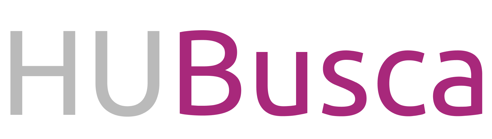

<h1 align="center">
  
</h1>

<p align="center">
  
  
  <!-- iOS -->
  
  <!-- Android -->
  
</p>

<p align="center">
  <a href="#-tecnologias">Tecnologias</a>&nbsp;&nbsp;&nbsp;|&nbsp;&nbsp;&nbsp;
  <a href="#-projeto">Projeto</a>&nbsp;&nbsp;&nbsp;|&nbsp;&nbsp;&nbsp;
  <a href="#-layout">Layout</a>&nbsp;&nbsp;&nbsp;|&nbsp;&nbsp;&nbsp;
  <a href="#-instalação">Instalação</a>&nbsp;&nbsp;&nbsp;|&nbsp;&nbsp;&nbsp;
  <a href="#-licença">Licença</a>
</p>

## 🚀 Tecnologias

Esse projeto foi desenvolvido com as seguintes tecnologias:

- [React Native](https://facebook.github.io/react-native/)
- [Expo](https://expo.io/)
- [Typescript](https://www.typescriptlang.org/)

## 📝 Projeto

O HuBusca é o desafio da ClickSoft para developer React Native, onde o desafio baseia-se em listar, cadastrar e excluir posts, além de também exibir o usuário que a criou.

## 🔖 Layout

Você pode visualizar o conceito de layout do projeto através [desse link](https://www.figma.com/file/YFrgJEfMu2BHKwcPrqEnBj/HUBusca?node-id=0%3A1).


## 💻 Instalação

```bash
# Clone this repository
$ git clone https://github.com/uZimbra/hubusca

# Go into the repository
$ cd hubusca

# Install dependencies
$ yarn install

# Start
$ yarn start

```


## 🔒 Licença

Copyright (c) 2021 Rodrigo A. Silva

Under MIT License